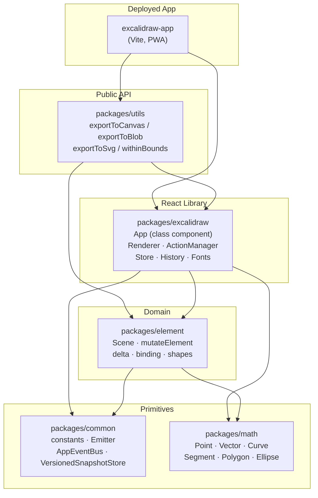
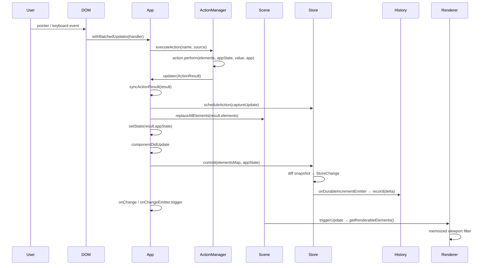

# Architecture

## High-level Architecture

The repository is a **Yarn workspaces monorepo** with a strict one-directional dependency graph. The deployed web app and the published npm library share the same source packages.



### Key constraint
ESLint enforces this graph. No package may import from a package above it. Circular imports are a build error.

---

## Data Flow

### User interaction → scene update



### External API update (host app)

```
host calls api.updateScene({ elements, appState, captureUpdate })
  → store.scheduleMicroAction({ action: captureUpdate, ... })
  → scene.replaceAllElements(elements)
  → setState(appState)
  → (same componentDidUpdate path as above)
```

### Direct element mutation (drag, resize)

For performance-critical gestures (drag, resize), mutations bypass `replaceAllElements`:

```
mutateElement(element, elementsMap, updates)
  → mutates object in place
  → bumps element.version, versionNonce, updated
  → ShapeCache.delete(element)  ← invalidates RoughJS cache
  → does NOT call setState / triggerUpdate

scene.mutateElement(element, updates, { informMutation: true })
  → calls mutateElement
  → calls scene.triggerUpdate() → App.triggerRender() → setState({})
```

---

## State Management

### AppState — React class state

`this.state` in `App` is the canonical UI state (~60 fields). Defined in `packages/excalidraw/appState.ts` with `getDefaultAppState()`.

Categories:

| Category | Fields |
|----------|--------|
| Viewport | `scrollX`, `scrollY`, `zoom`, `width`, `height`, `offsetLeft`, `offsetTop` |
| Active tool | `activeTool`, `penMode`, `selectionType`, `croppingElementId` |
| Selection | `selectedElementIds`, `hoveredElementIds`, `editingGroupId` |
| UI panels | `openSidebar`, `openDialog`, `openMenu`, `contextMenu` |
| Drawing props | `currentItemStrokeColor`, `currentItemFontSize`, `currentItemRoughness`, … |
| Collaboration | `collaborators`, `userToFollow`, `followedBy` |
| Export | `exportScale`, `exportBackground`, `exportWithDarkMode`, `exportEmbedScene` |
| Grid/snap | `gridSize`, `gridStep`, `gridModeEnabled`, `objectsSnapModeEnabled` |

`APP_STATE_STORAGE_CONF` (same file) is a per-field map with three boolean dimensions:
- `browser` — persisted to localStorage/IDB across page reloads
- `export` — included in `.excalidraw` JSON export
- `server` — synced via collaboration / share link

### Scene — element registry (outside React)

`Scene` (`packages/element/src/Scene.ts`) owns all elements as mutable objects. It maintains four always-in-sync structures:

```
elements[]               ← ordered array (including deleted)
elementsMap              ← Map<id, element> (including deleted)
nonDeletedElements[]     ← filtered array
nonDeletedElementsMap    ← filtered Map<id, element>
```

`scene.getSceneNonce()` returns a random integer regenerated on every `replaceAllElements` or `triggerUpdate` call. It serves as the cache-invalidation key for `Renderer.getRenderableElements`.

React is notified of scene changes only via `scene.onUpdate(callback)`. App registers `this.triggerRender` as that callback in `componentDidMount`.

### Store — change capture

`Store` (`packages/element/src/store.ts`) bridges the scene and history. It holds a `StoreSnapshot` (frozen copy of `SceneElementsMap` + `ObservedAppState`) and computes diffs on each `commit()`.

**`CaptureUpdateAction`** enum (source of truth in `store.ts`):

| Value | Meaning |
|-------|---------|
| `IMMEDIATELY` | Diff is captured now → emitted as `DurableIncrement` → `History.record()` |
| `EVENTUALLY` | Deferred — merged into the next `IMMEDIATELY` commit (async multi-step ops) |
| `NEVER` | Never recorded — used for remote collaboration updates and scene initialization |

`commit(elementsMap, appState)` is called unconditionally at the **end of every `componentDidUpdate`**. To find the call site, search `App.tsx` for `store.commit(` — it appears exactly once, at the end of `componentDidUpdate`.

### History — undo/redo

`History` (`packages/excalidraw/history.ts`) maintains two stacks of `StoreDelta` objects. Each `StoreDelta` wraps an `ElementsDelta` and an `AppStateDelta`, each carrying `{ deleted: Partial<T>, inserted: Partial<T> }` maps. `inverse()` swaps them to reverse an operation.

### ActionManager — command registry

`ActionManager` (`packages/excalidraw/actions/manager.tsx`) stores all actions in `actions: Record<ActionName, Action>`.

```typescript
// Action interface (simplified)
interface Action {
  name: ActionName;
  perform: (elements, appState, formData, app) => ActionResult;
  keyTest?: (event, appState, elements, app) => boolean;
  keyPriority?: number;   // higher = tested first on keydown
  viewMode?: boolean;     // whether this action works in view mode
}
```

`executeAction(action, source, value)`:
1. Calls `action.perform(elements, appState, value, app)`
2. Passes result to `this.updater` which is `App.syncActionResult`
3. `syncActionResult` schedules a store action, updates scene and appState

`handleKeyDown` iterates all registered actions sorted by `keyPriority` descending, calling each `keyTest`. Exactly one must match or the key press is ignored (multiple matches → warning + cancel).

### Jotai — fine-grained atoms

`editor-jotai.ts` creates an isolated Jotai scope via `jotai-scope`'s `createIsolation()`. This allows multiple Excalidraw instances on one page without shared atom state.

`App.updateEditorAtom(atom, ...args)` is the only way to set atoms from class-component code — it calls `editorJotaiStore.set(atom, ...args)` then `this.triggerRender()`.

Components subscribe directly via the re-exported `useAtomValue` / `useAtom` hooks from `editor-jotai.ts`.

### AppStateObserver — selector-based subscriptions

`AppStateObserver` (`components/AppStateObserver.tsx`) is called `appStateObserver.flush(prevState)` on every `componentDidUpdate`. It notifies subscribers registered via `api.onStateChange(selector, callback)` only when the selected slice actually changed — no polling, no extra renders.

---

## Rendering Pipeline

### Overview

Five layers are painted on every render, stacked by z-index:

```
Layer 1: StaticCanvas   (HTMLCanvasElement, class "static")
Layer 2: InteractiveCanvas (HTMLCanvasElement, class "interactive")
Layer 3: NewElementCanvas  (HTMLCanvasElement, for in-progress element)
Layer 4: SVG layer      (React SVG, selection boxes and handles)
Layer 5: React DOM      (toolbars, menus, dialogs, sidebars)
```

### StaticCanvas

**Component**: `components/canvases/StaticCanvas.tsx` — `React.memo` with a custom `areEqual` comparator.

Re-renders only when `sceneNonce`, `scale`, `elementsMap`, `visibleElements`, or relevant `AppState` fields change (shallow-compared via `getRelevantAppStateProps`).

**On every render** (no explicit dependency array — bare `useEffect`):

```
renderStaticScene(config, isRenderThrottlingEnabled())
  → throttleRAF (requestAnimationFrame-throttled) when throttling enabled
  → _renderStaticScene(config) always when throttling disabled (export path)
```

Inside `_renderStaticScene`:
1. `bootstrapCanvas` — resize canvas, apply device pixel ratio scale, paint background
2. `context.scale(zoom.value, zoom.value)` — apply zoom transform
3. `strokeGrid(...)` — draw grid lines if enabled
4. Per-element: `renderElement(element, rc, context, ...)` → reads from `ShapeCache` or generates RoughJS `Drawable` and caches it

### InteractiveCanvas

**Component**: `components/canvases/InteractiveCanvas.tsx`

Re-renders on pointer moves, selection changes, collaboration cursor updates, snap lines, and binding highlights. Calls `renderInteractiveScene(...)` from `renderer/interactiveScene.ts` (57KB — the largest renderer file).

Renders: selection bounding boxes, transform handles, remote pointer cursors, binding highlights, snap guide lines, focus points, text-editing cursors.

### Renderer class (scene/Renderer.ts)

`Renderer.getRenderableElements` is a **memoized function** (via `memoize` from `@excalidraw/common`). Cache key is the combination of viewport params + `sceneNonce`. On cache miss it:

1. Calls `scene.getNonDeletedElements()`
2. Excludes the element with `newElementId` (being actively drawn)
3. Excludes `editingTextElement` (rendered by WYSIWYG overlay instead)
4. Filters remaining elements through `isElementInViewport(...)` → `visibleElements[]`
5. Returns `{ elementsMap: RenderableElementsMap, visibleElements }`

### ShapeCache

`ShapeCache` (in `packages/element/src/shape.ts`) is a `WeakMap<ExcalidrawElement, { shape: ElementShape; theme: AppState["theme"] }>` keyed by element object reference — not by element id string. `renderElement` calls `ShapeCache.generateElementShape(element, renderConfig)`, which reads from or populates the cache using the same element reference as the lookup key. `mutateElement` calls `ShapeCache.delete(element)` — passing the element reference — when geometry fields (`height`, `width`, `points`, `fileId`) change.

---

## Package Dependencies

### Verified dependency edges

```
packages/math
  └── (no internal deps)

packages/common
  └── (no internal deps)

packages/element
  ├── @excalidraw/math    (types, geometry ops)
  └── @excalidraw/common  (constants, utils, Emitter, utility-types)

packages/excalidraw
  ├── @excalidraw/element  (Scene, mutateElement, types, delta, binding)
  ├── @excalidraw/common   (constants, utils, AppEventBus, EditorInterface)
  └── @excalidraw/math     (point operations in App.tsx, renderer)

packages/utils
  ├── @excalidraw/excalidraw  (scene/export, data/restore, clipboard)
  ├── @excalidraw/element     (types, getElementAbsoluteCoords, typeChecks)
  ├── @excalidraw/common      (MIME_TYPES, Bounds, invariant)
  └── @excalidraw/math        (geometry for shape.ts, withinBounds.ts)

excalidraw-app
  ├── @excalidraw/excalidraw  (React component, ExcalidrawImperativeAPI)
  └── @excalidraw/utils       (exportToCanvas, exportToBlob, exportToSvg)
```

### Cross-cutting concerns

| Concern | Owner |
|---------|-------|
| Element type definitions | `packages/element/src/types.ts` |
| AppState type + defaults | `packages/excalidraw/appState.ts` |
| All named constants | `packages/common/src/constants.ts` |
| Coordinate system types | `packages/math/src/types.ts` |
| Event bus primitives | `packages/common/src/emitter.ts`, `appEventBus.ts` |
| Public npm export surface | `packages/excalidraw/index.tsx`, `packages/utils/src/index.ts` |

### Import rules enforced by ESLint

- `packages/excalidraw` internals must use **direct file imports**, not the package's own barrel `index.tsx`
- All Jotai usage inside `packages/excalidraw` must go through `editor-jotai.ts` or `app-jotai.ts` — direct `jotai` imports are linted errors
- `packages/element` and `packages/common` must not import from `packages/excalidraw`
